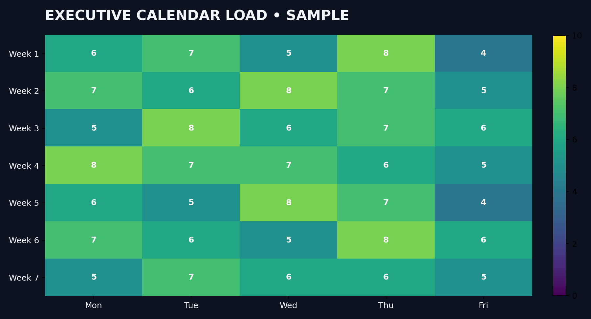

# Executive Calendar Management

### Kiran Kumar Ambati
**Senior Executive Assistant | Executive Office | Calendar & Meeting Management**

> A portfolio demonstration of structured executive calendar planning, prioritization, meeting coordination, conflict management and executive time optimization.

---

## 📅 Executive Calendar Management

Effective calendar management is more than scheduling meetings. It requires understanding priorities, protecting executive time, managing conflicts and ensuring that important business activities receive appropriate attention.

### Core Responsibilities

| Area | Approach |
|---|---|
| 📅 Calendar Planning | Structure daily, weekly and monthly executive schedules |
| 🎯 Priority Management | Align meetings and activities with business priorities |
| 🤝 Meeting Coordination | Schedule participants, rooms, virtual links and agendas |
| ⚠️ Conflict Resolution | Identify conflicts and propose practical alternatives |
| ⏱️ Time Optimization | Protect focus time, buffers and critical commitments |
| 🔄 Rescheduling | Coordinate changes while minimizing business disruption |
| 📋 Follow-up | Track actions, commitments and pending decisions |
| 🔐 Confidentiality | Handle sensitive executive schedules with discretion |

---

## 🧠 Executive Calendar Operating Model

### Capture → Prioritize → Schedule → Confirm → Execute → Follow Up

**1. Capture**  
Collect meeting requests, appointments, deadlines and executive commitments.

**2. Prioritize**  
Evaluate urgency, business impact, stakeholders and executive availability.

**3. Schedule**  
Create an efficient schedule while protecting buffers and priority activities.

**4. Confirm**  
Validate participants, locations, virtual meeting details and required materials.

**5. Execute**  
Monitor the calendar throughout the day and proactively manage changes.

**6. Follow Up**  
Track action items, rescheduling requirements and outstanding commitments.

---

## 📊 Calendar Workload Dashboard



> **Portfolio demonstration:** The dashboard uses fictional/sanitized data to demonstrate calendar workload analysis and reporting capability.

### Dashboard Focus

- Meeting workload
- Daily calendar utilization
- Meeting categories
- Executive time allocation
- Scheduling patterns
- Workload visibility

---

## ⚠️ Calendar Conflict Management

A structured conflict-resolution approach:

```text
Identify Conflict
       ↓
Assess Business Priority
       ↓
Check Stakeholder Impact
       ↓
Review Alternative Slots
       ↓
Reschedule / Delegate
       ↓
Confirm Updated Calendar
       ↓
Communicate Changes
